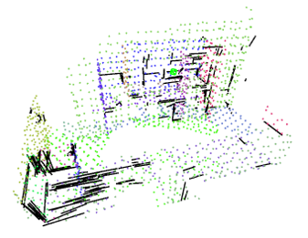
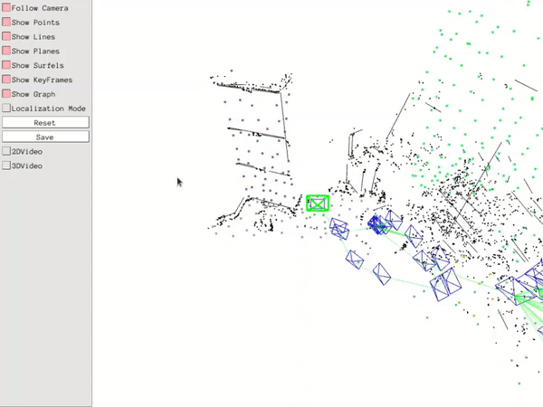

## Development
-  Implemented RGBD-inertial functionality on top of ManhattanSLAM by tightly coupling with IMU
-  Evaluated the robustness after integrating with IMU on [FMDataset](https://github.com/zhuzunjie17/FastFusion)
    -  Using [script](https://github.com/tin1254/FMDataset_preprocessing) for aligning color and depth map
    -  Fill in SLAM config according to documentation of FMDataSet
        - `ManhattanSLAM/Examples/RGB-D-Inertial/FMDataset.yaml`
    - Implement excutable for loading FMDataSet
        -  `ManhattanSLAM/Examples/RGB-D-Inertial/rgbd_fm.cc`
    -  Tried evaluating by running real-time on ROS with  Intel RealSense D455
        -  **NOT RECOMMENDED**: ManhattanSLAM is too computation demanding, if it is run in real-time, it will have a very high probability of throwing away some data during runtime, as usual laptops are too slow for it.  As a result, the system will be highly unstable.

## Results

### Dense reconstruction of `dorm1`


### Sparse reconstruction of `dorm1`


### Running with ROS in real-time


## Caveats for building

### Build ManhattanSLAM
Tested on Ubuntu 20.04
- ManhattanSLAM only support building with C++11
    -  Set support version of PCL and VTK in cmake before compiling
- Require PCL with C++11 (tested with PCL v1.9.1)
    - Enable `WITH_QT` and `WITH_VTK`
        - Built with VTK v.8.x.x (tested with VTK v8.2.0) 
        - Set `VTK_DIR` to the directory of the correct VTK version

### Compile OpenCV with LSD
LSD was removed in the newest version of opencv, [reason](https://github.com/opencv/opencv_contrib/issues/2016)

1. Donwload older version of Opencv (>=2.4.3 && < 4.0, tested with v3.4.1)
2. Download `opencv_contrib` 
3. set `OPENCV_EXTRA_MODULES_PATH` to the path `<opencv_contrib>/modules`

## Example

### run RGB-D only
```bash
./Examples/RGB-D/rgbd_tum Vocabulary/ORBvoc.txt Examples/RGB-D/TUM3.yaml YOUR_PATH/rgbd_dataset_freiburg3_structure_texture_near ./Examples/RGB-D/assoications/associations_fb_texture.txt
```

### run RGB-D with IMU
Example dataset can be downloaded from [here](https://github.com/zhuzunjie17/FastFusion).

Color image and depth map **MUST** be aligned before running the dataset.
```bash
./Examples/RGB-D/rgbd_inertial Vocabulary/ORBvoc.txt Examples/RGB-D-Inertial/FMDataset.yaml YOUR_PATH/dorm1_slow Examples/RGB-D-Inertial/assoications/associations_dorm1_slow.txt
```

## Issues
-  `error while loading shared libraries: libvtkRenderingCore-8.2.so.1: cannot open shared object file: No such file or directory`
    -  Run `export LD_LIBRARY_PATH=/usr/local/lib:$LD_LIBRARY_PATH` in the terminal or write to `.bashrc`
-  Running in real-time with ROS is very instable
    -  Not recommended to run with ROS
-  Lines will be optimized away in local BA
    -  These are also observed in the first version of ManhattanSLAM al the beginning of this guided research (not sure if this is fixed in the lastest ManhattanSLAM)
    -  Mathematics formulae in the optimization were inpsected carefully, but no bug was found
-  g2o triggers [eigen unaligned array assertion](http://eigen.tuxfamily.org/dox-devel/group__TopicWrongStackAlignment.html) (segmentation fault if g2o is built in `Release` mode) in `PoseOptimization`
    -  This has never occured before I installed the newest version of Ubuntu 20.04 
    -  Optimizing values were inspected and non `NAN` value was found
    -  Try old version of Ubuntu

